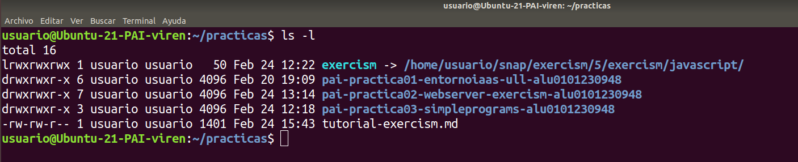

# Tutorial de cómo trabajar cómodamente con Exercism
## Introducción
El objetivo de este tutorial es configurar correctamente el directorio donde se guardan los proyectos que realizamos en Exercism por defecto. Como bien sabemos, cuando intentamos resolver un ejercicio nuevo se ejecuta:
``` bash
$ exercism download --exercise=bank-account --track=javascript
Downloaded to
/home/usuario/snap/exercism/5/exercism/javascript/bank-account
```
Esto es incómodo puesto que está en un directorio bastante profundo y es difícil acceder a él de manera cómoda.
## Enlace simbólico
Una solución bastante sencilla es establecer un enlace simbólico con el directorio donde se alojan todos los ejercicios de JavaScript. Así pues, nos situamos en el directorio donde queremos crear el enlace simbólico y escribimos el siguiente comando:
``` bash
$ ln -s ~/snap/exercism/5/exercism/javascript/ exercism
```
Esto creará un enlace simbólico con el nombre `exercism`, así podemos acceder al directorio con los ejercicios de JavaScript con el siguiente comando:
``` bash
$ cd exercism
```
Por ejemplo, en mi caso el enlace simbólico lo creé en el directorio `~/practicas`, por lo que puedo ejecutar:
``` bash
$ cd ~/practicas/exercism
```
Y así no tengo que indicar la ruta completa. Se debería ver de la siguiente manera si ejecutamos un `ls`:

## Cambiar directorio de trabajo 
No obstante, hay una opción aún mejor que es cambiar el directorio de trabajo por defecto de exercism. Por ejemplo, si queremos que el directorio de trabajo sea el de la práctica 3, indicamos en terminal:
``` bash
$ exercism configure -w ~/practicas/pai-practica03-simpleprograms-alu0101230948/

You have configured the Exercism command-line client:

Config dir:                       /home/usuario/snap/exercism/5/.config/exercism
Token:         (-t, --token)      38c5616e-2d5e-412d-8879-be832a099dbe
Workspace:     (-w, --workspace)  /home/usuario/practicas/pai-practica03-simpleprograms-alu0101230948
API Base URL:  (-a, --api)        https://api.exercism.io/v1
```
Ahora, ya tenemos listo el directorio de trabajo para la práctica 3, así que si empezamos por el primer ejercicio haremos lo siguiente:
``` bash
$ exercism download --exercise=armstrong-numbers --track=javascript

Downloaded to
/home/usuario/practicas/pai-practica03-simpleprograms-alu0101230948/javascript/armstrong-numbers
$ cd ~/practicas/pai-practica03-simpleprograms-alu0101230948/
$ tree
.
├── LICENSE
├── README.md
├── javascript
│   └── armstrong-numbers
│       ├── README.md
│       ├── armstrong-numbers.js
│       ├── armstrong-numbers.spec.js
│       ├── babel.config.js
│       └── package.json
└── p03_SimplePrograms.md

2 directories, 8 files
```

Nota: el comando tree es solo una manera visual de ver el árbol de directorios partiendo del directorio actual. Si quiere instalarlo, ejecute:
``` bash
$ sudo apt-get install tree
```
